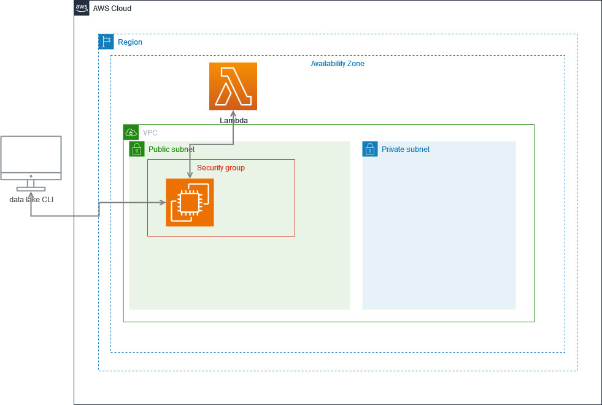

# Architecture

The depicted architecture represents the implemented system architecture.

Our application is divided into two microservices, representing the api and ui, each launched in private subnets in multiple availability zones. These modules reside in an ECS cluster and their respective host service is connected to an internal application load balancer that manages traffic through the system, whilst also bridging the connection to the api gateway.
Each of the instantiated microservices has a corresponding api gateway to allow direct communication with end users.
To store all data, the api objects access a MySQL database in an RDS service
The images used to deploy the services are imported from ECR repositories that update through a CD pipeline directly from our git repository.
Cognito is also used to manage and verify user credentials.

This architecture can be deployed by running the terraforma file, with the exception of the cognito and ECR services that need to be manualy configured.

