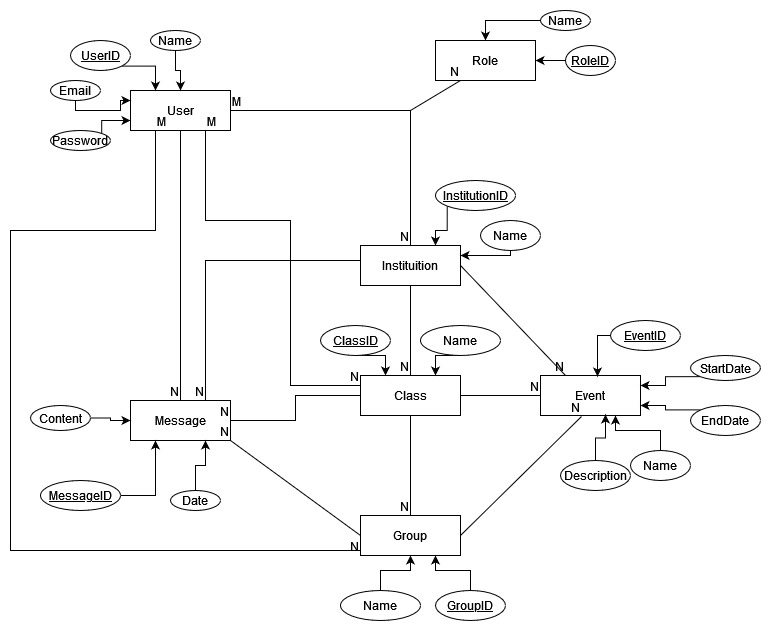
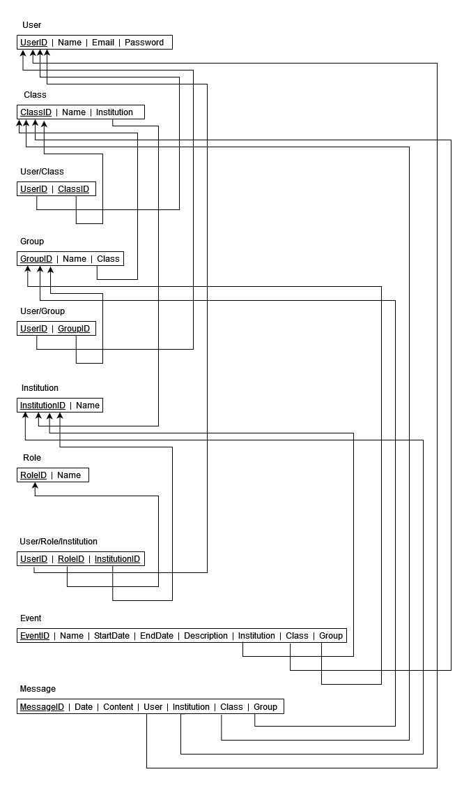

# Database

## Entities:

1. **Class**
   - **Description**: This entity represents a class of students which may contain one or more groups and is associated to an institution
   - **Attributes**:
     - ClassID: The identifier of a class.
     - Name: The name of a class.

2. **Group**
   - **Description**: This entity represents a group of students and is associated to a class.
   - **Attributes**:
     - GroupID: The identifier of a group.
     - Name: The name of a group.

3. **User**
   - **Description**: This entity represents a user of this application. This user can be either a student or an institution.
   - **Attributes**:
     - UserID: The identifier of an user.
     - Name: The name of an user.
     - Email: The email of an user.
     - Password: The password of an user.

4. **Role**
   - **Description**: This entity represents the role that an user will have and what permission will be granted in the system. The same user can have different roles in different institutions, classes and groups.  
   - **Attributes**:
     - RoleID: The identifier of a role.
     - Name: The name of a role.

5. **Institution**
   - **Description**: This entity represents a teaching institution.
   - **Attributes**:
     - InstitutionID: The identifier of an institution.
     - Name: The name of an institution.

6. **Event**
   - **Description**: This entity represents an event. Each event is associated to an institution, a class and a group.
   - **Attributes**:
     - EventID: The identifier of an event.
     - Name: The name of an event.
     - StartDate: The starting date of an event.
     - EndDate: The finishing date of an event.
     - Description: A descripton of an event.

7. **Message**
   - **Description**: This entity represents a message. Each message is associated to an user, an institution, a class and a group
   - **Attributes**:
     - MessageID: The identifier of a message.
     - Date: The date when a message was sent.
     - Content: The content of a message.

## Entity-Relationship Diagram (ERD):

## Relational Schema:

