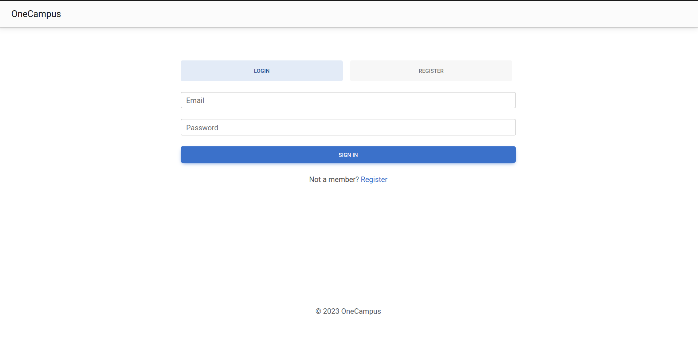

# Authentication

## Description
- Functionality to authenticate a user.

## Usage

### Requirements
- The user must have an account.

### Walkthrough

1. Click on the "Sign in" button in the top right corner of the page.

2. Fill in the form with your credentials and click on "Sign in".

3. You are now authenticated and can access the functionalities of the application.

### Possible errors

- If the credentials are incorrect, an error message will be displayed.

