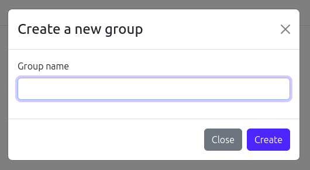

# Create groups

## Description
- Functionality to create a group within a class.

## Usage

### Requirements
- The user must be authenticated.

### Walkthrough

1. Hover the cursor over the class in which you want to create a group and click on the '+' icon.  
  
2. Fill in the form with the group name and click on "Create".  

