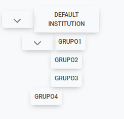

# Forum

## Description
- **Questions**: Users can post questions for other users that belong to the same group to see.
- **Answers**: Users can answer questions posted in the forum.
- **Search bar**: Users can filter the questions by using the search bar.

## Usage

### Requirements
- The user must be authenticated.
- The user must be in a group.
- The user must have permission to post questions and submit answers.

### Walkthrough

1. Click on one of the groups.  
  
2. Write the question in the input box.  

3. The question has been posted on the forum of the selected group.

4. The search bar can be used to filter through questions.

5. To answer a question, select the question and a dropdown will appear. Then click on the button "Add New Answer".

6. A modal will appear, with an input to write the answer. To submit the answer click on "Add".

7. The answer has been posted under the selected question.
