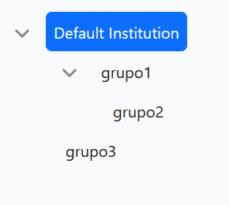
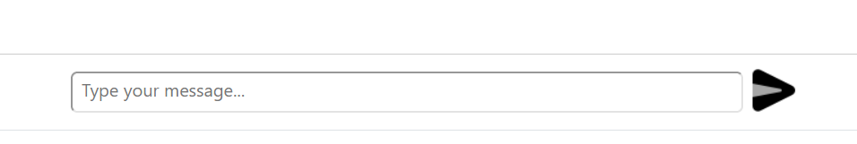
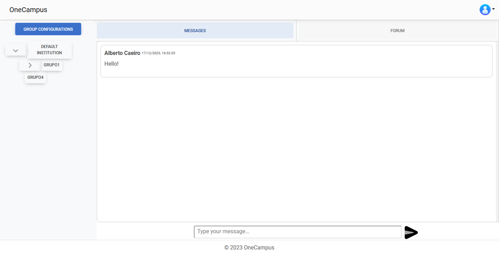

# Messages

## Description
- **Real-time Messaging**: Users can send and receive messages in real-time.
- **Message Display**: Messages are displayed in a scrollable container.
- **User Input**: Users can type and send messages through an input field.
- **Automatic Message Fetching**: New messages are fetched periodically.

## Usage

### Requirements
- The user must be authenticated.
- The user must be in a group.

### Walkthrough

1. Click on one of the groups.  
  
2. Write a message in the input box.  

3. The message has been written on the chat of the selected group.

