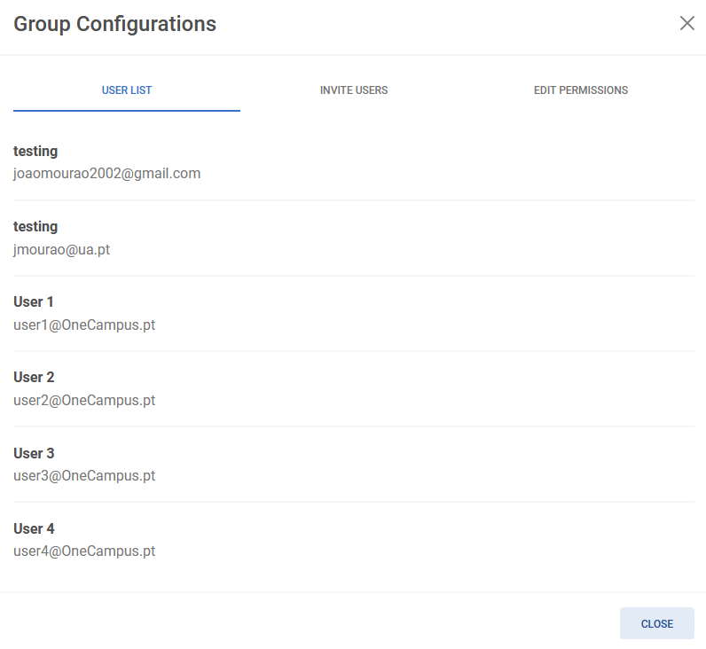
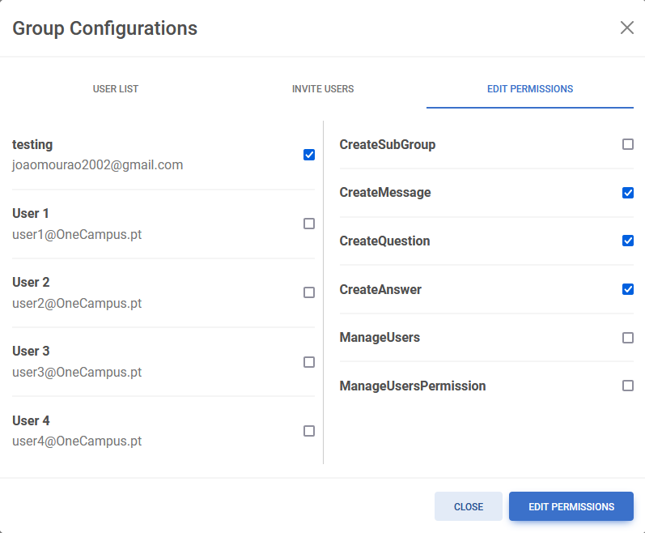
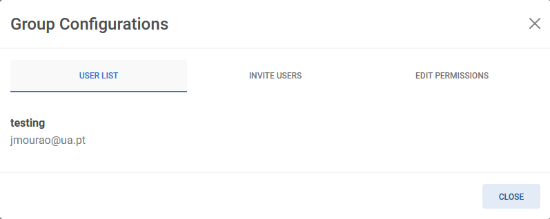
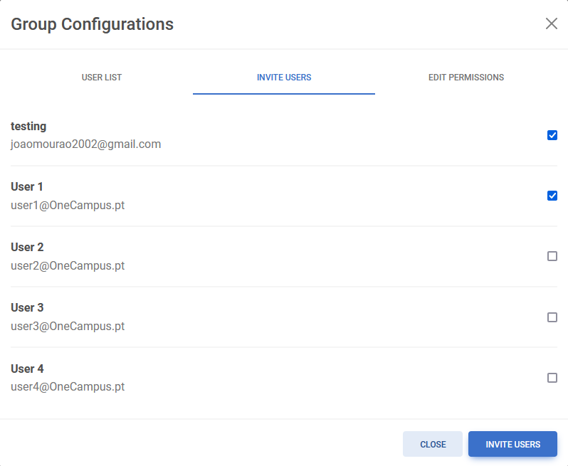
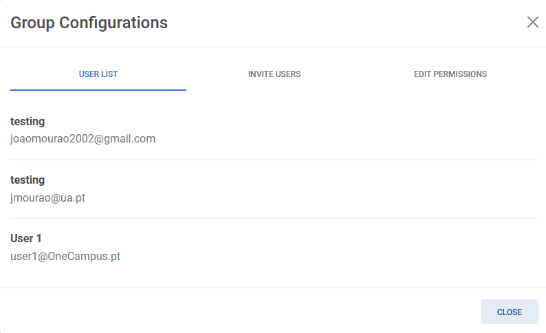

# Permissions

## Description
- **View user list**: Users can view the user list for a group they are part of.
- **Invite users**: Users can invite other users to a group.
- **Edit Permissions**: Users can edit permissions of other users in the group.

## Usage

### Requirements
- The user must be authenticated.
- The user must be in a group.
- The user must have permission to edit the group permissions.

### Walkthrough

1. Click on the button "Group Configurations".  
  
2. The user list of the group will be displayed.

3. In order to edit user permissions, selected the tab "Edit Permissions". Then select the users whose permissions are to be edited on the left and the permissions that are to be given on the right. Finally click on "Edit Permissions".

4. In order to invite other users to a group you must be in a group that the user that is to be invited is not.

5. Go to the tab "Invite Users" and select the users that are to be invited and then click on "Invite users".

6. The invited users are now displayed in the group's user list.
