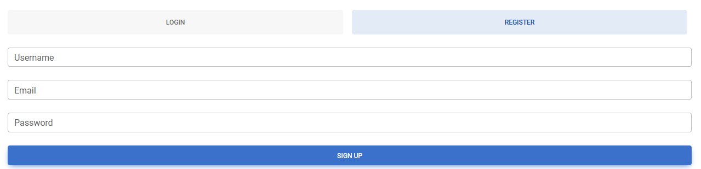
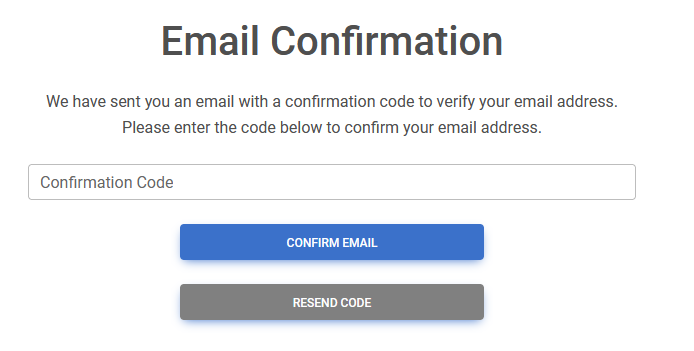
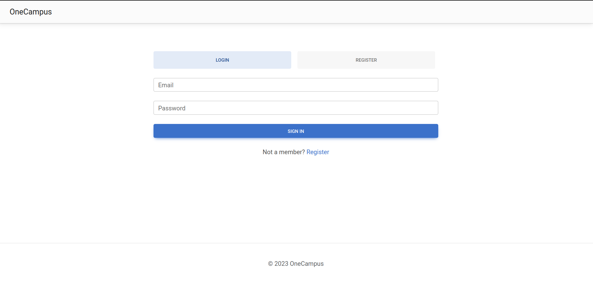

# Register

## Description
- Register a user.

## Usage

### Requirements
- There must not exist an account with the desired email.
- The desired password must have at least 8 characters, one special charater, one uppercase and one lowercase letter.
- Username must not be empty

### Walkthrough

1. Click on the "Sign in" button in the top right corner of the page.

2. Fill in the form with your username, email and password.

3. You will receive a code to your email. Write the code sent in the input box and click "Confirm email". If you didn't receive a code or the code is not working, try requesting another code by clicking on the button "Resend code".

4. After the code has been confirmed, you will be redirected to the login page. Just fill the form with your credentials.

### Possible errors

- An account with that email already exists.
- The password doesn't meet the requirements.
- Username is invalid.
- The code is invalid.

